# DS Design System

A strategy-grade design system for executive reporting, data analytics, and management consulting deliverables. Minimalist, authoritative, and opinionated — inspired by Big 4 consulting aesthetics.

Built around a restrained palette of navy and gold: sharp corners, serif titles, and purposeful use of color.

---

## Features

- **Color system** with semantic meaning (navy = authority, gold = highlight, green = positive, burgundy = negative)
- **6 component types** — bar, comparison bar, line, KPI cards, waterfall, tables
- **Report template** — executive summary, key findings, recommendations with priority tags
- **Typography system** — DM Serif Display for impact, Inter for body, IBM Plex Mono for data
- **Zero border-radius** — sharp, formal, executive-ready

---

## Live Preview

Open [`index.html`](index.html) locally or visit the **[live demo →](https://dms1996.github.io/design-system/)**

---

## Color Palette

<p align="center">
  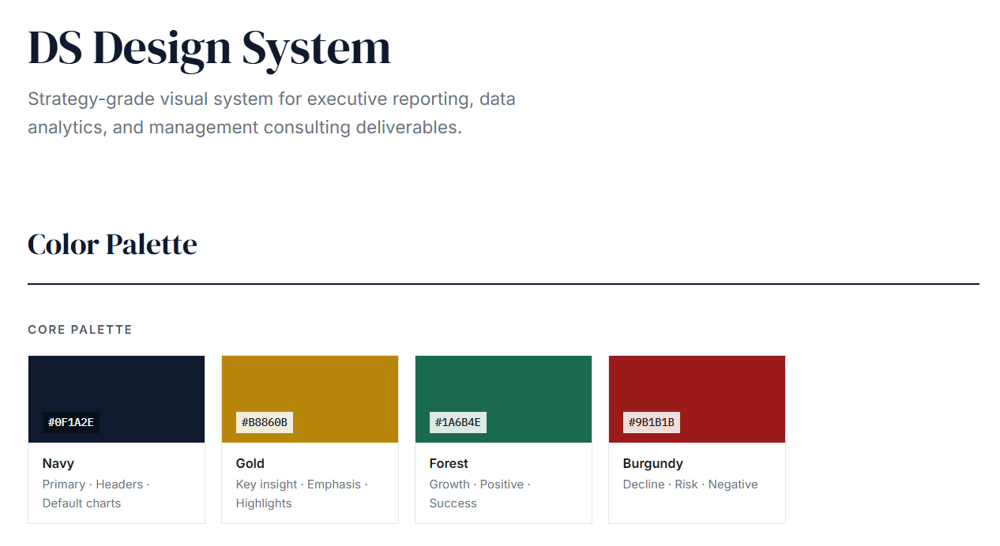
</p>

Four core colors with strict semantic roles: Navy for authority and default charts, Gold for key insights, Forest for positive indicators, Burgundy for risk and decline.

### Neutrals

<p align="center">
  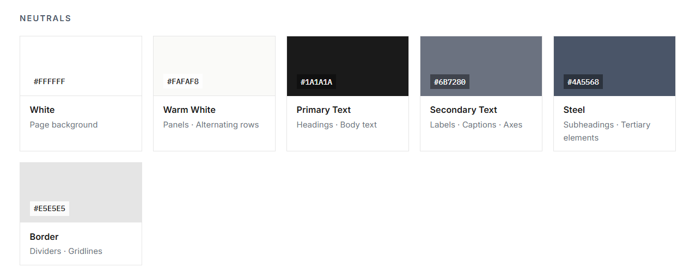
</p>

White and warm white backgrounds, three text weights for hierarchy, and a single border tone for dividers and gridlines.

### Extended

<p align="center">
  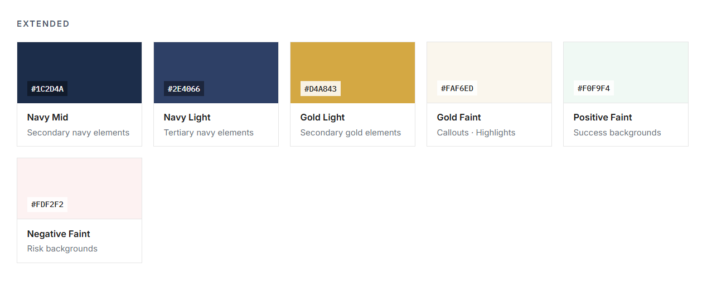
</p>

Navy and gold scale into lighter variants for multi-series charts. Faint tints provide subtle backgrounds for callouts, success states, and risk indicators.

---

## Semantic Meaning & 60-30-10 Rule

<p align="center">
  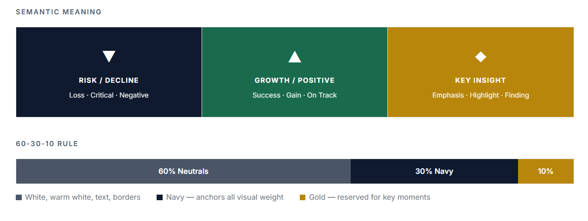
</p>

Navy anchors risk and decline, Forest signals growth and success, Gold highlights key insights. The 60-30-10 rule governs every visual: 60% neutrals, 30% navy, 10% gold — sparingly.

---

## Chart Palettes

<p align="center">
  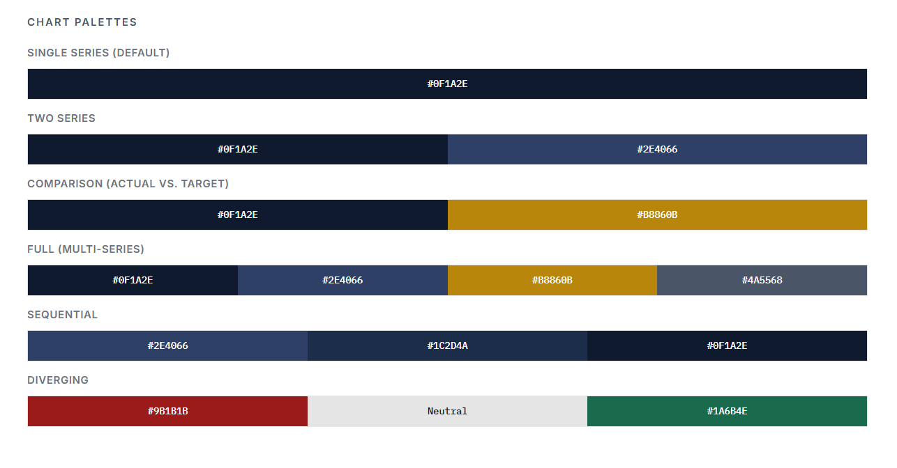
</p>

Six palette modes covering single-series defaults, two-series comparisons, actual vs. target tracking, multi-series breakdowns, sequential intensity scales, and diverging positive/negative variance.

---

## Typography

<p align="center">
  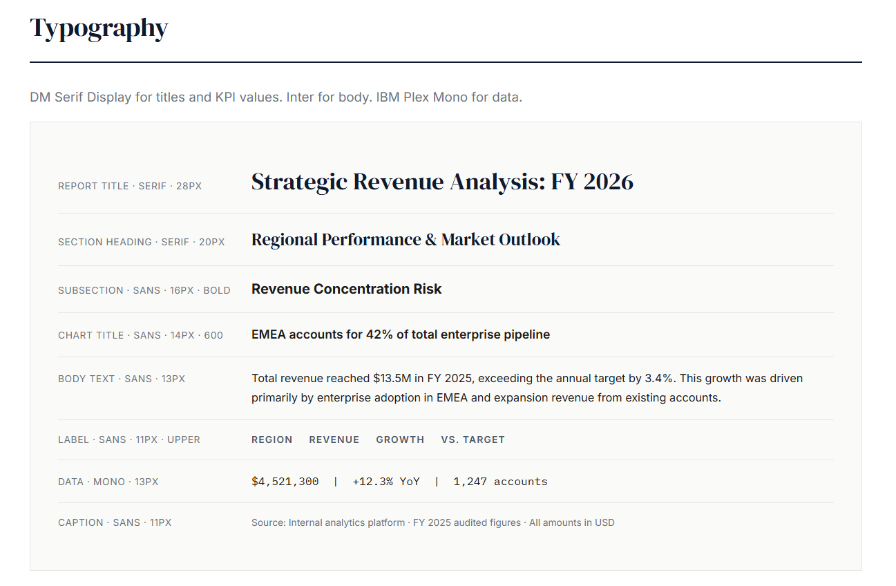
</p>

DM Serif Display for report titles and section headings. Inter for body text, chart titles, and labels. IBM Plex Mono for data values and tabular numerics. Eight levels of hierarchy from 28px titles down to 11px captions.

---

## KPI Cards

<p align="center">
  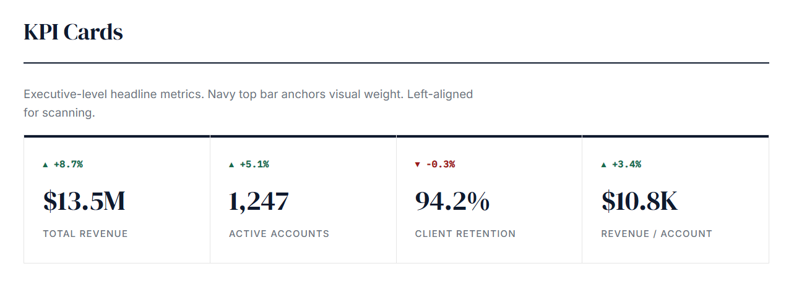
</p>

Executive-level headline metrics. Navy top bar anchors visual weight. Serif values with delta indicators using semantic color.

---

## Chart Styles


<p align="center">
  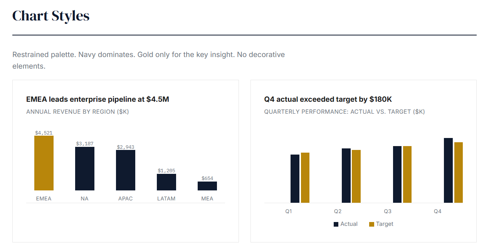
</p>


<p align="center">
  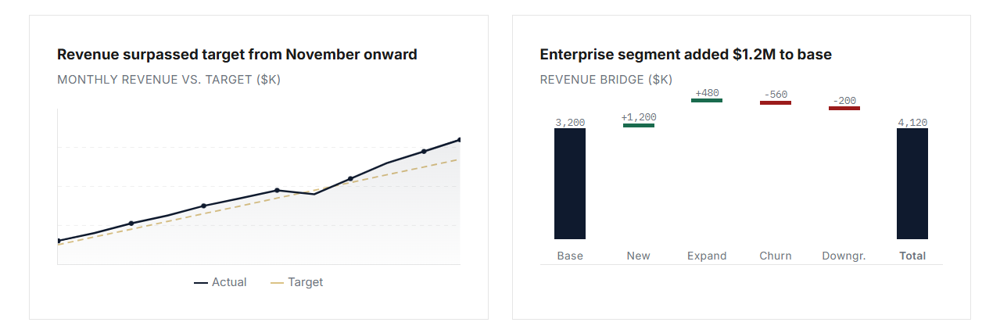
</p>

Navy dominates. Gold only for the key insight or target overlay. Green/burgundy reserved for semantic meaning in waterfall bridges.

---

## Table Design

<p align="center">
  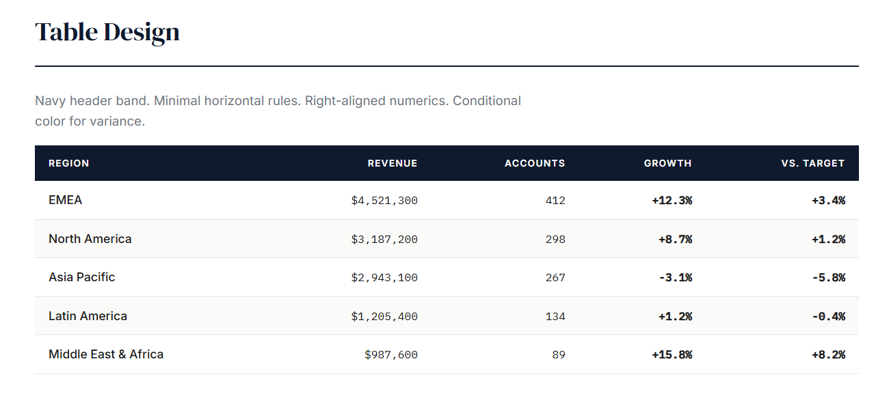
</p>

Navy header band with white text. Monospace right-aligned numerics. Conditional formatting for variance columns. Subtle zebra striping on hover.

---

## Writing Style

<p align="center">
  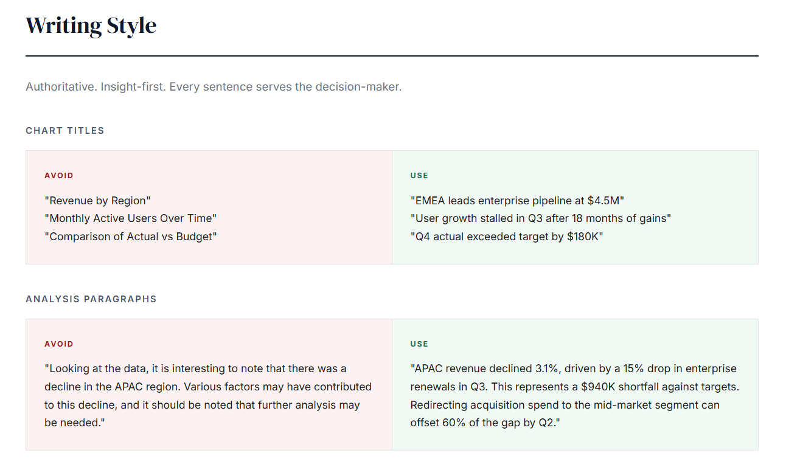
</p>

Authoritative. Insight-first. Every sentence serves the decision-maker. Lead with the conclusion, not the description.

---

## Number Formatting

<p align="center">
  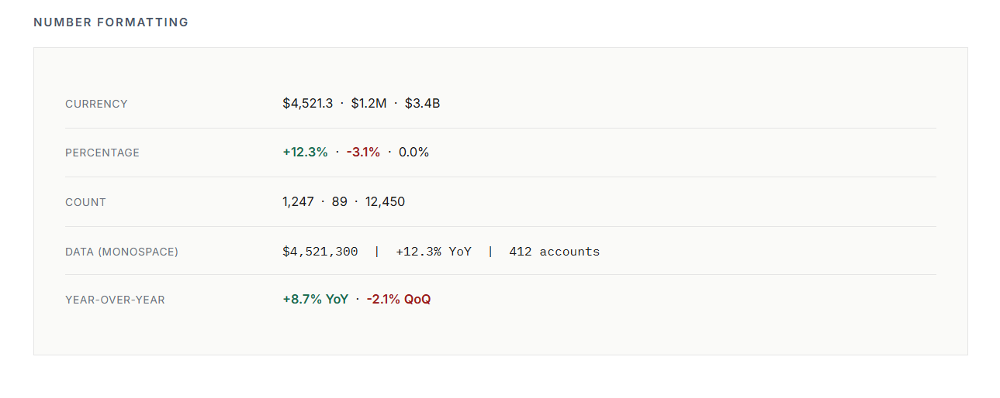
</p>

Standardized formats across all outputs: currency with comma separators and dollar prefix, signed percentages with one decimal, tabular counts, and year-over-year / quarter-over-quarter comparisons with monospace alignment.

---

## Design Principles

1. **Data-first** — clarity over decoration
2. **Executive-ready** — every output is presentable to C-suite
3. **Minimal** — remove anything that doesn't serve the data
4. **Consistent** — same styling across every visual
5. **Purposeful color** — every color choice carries meaning
6. **Authoritative** — sharp edges, serif titles, restrained palette

---

## Project Structure

```
ds-design/
├── index.html       # Full interactive design system reference
├── assets/          # Screenshots for documentation
└── README.md        # This file
```


---

*dms1996* - 2026 Portfolio
